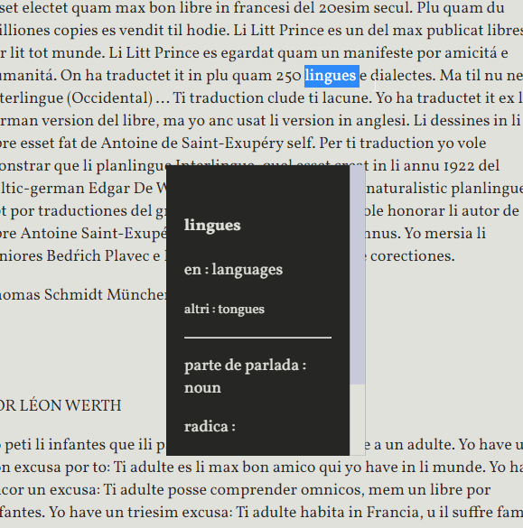
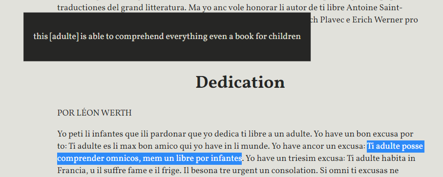

# Benevenit

Benevenit al Scritorium de Occidental.

# Usage

Iluminar un sol parol por vider un explication 

o iluminar mani paroles por vider un naiv traduction.

Selecter tui lingue preferet por li traductiones.

